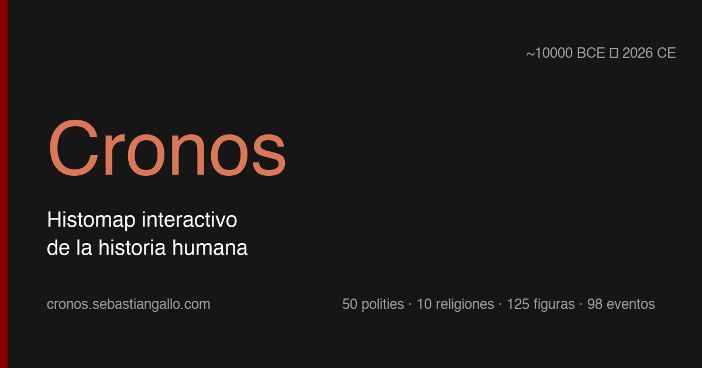

# Cronos

**Histomap interactivo de la historia humana** — civilizaciones, religiones, figuras y eventos clave en lanes paralelas con eje temporal compartido (~10000 BCE → 2026 CE), agrupadas por macro-región y filtrables.

🔗 **Live:** [cronos.sebastiangallo.com](https://cronos.sebastiangallo.com) *(pendiente conexión CF Pages — ver `docs/ACTION_ITEMS_FOR_SEBAS.md`)*



## Qué hay adentro (v1)

- **50 polities** balanceadas no-Eurocentric (≥3-5 por macro-región: Mediterráneo, Europa, Medio Oriente, Norte de África, África Sub-Sahariana, Sur de Asia, Este de Asia, Sudeste Asiático, Estepa, Américas).
- **10 tradiciones religiosas** canónicas (judaísmo, cristianismo, islam, hinduismo, budismo, jainismo, daoísmo, confucianismo, zoroastrismo, religiones indígenas como cluster).
- **125 figuras históricas** distribuidas por región/era (founders, rulers, filósofos, científicos, artistas).
- **99 eventos** pivotales (-1800 BCE → 1860 CE) en 7 categorías (militar, político, religioso, científico, cultural, económico, desastre).
- **Filtros funcionales** por macro-región, religión, tipo de entidad y rango temporal.
- **Side panel** con body markdown rendered, cross-refs y sources clickables.
- **Zoom-pan horizontal** sobre el eje BCE→CE con `d3-zoom`.

Curación documentada con reasoning en `docs/*-curation.md`. Toda la data en markdown editable (`content/`); el JSON es build artifact.

## Stack

- [Astro 4](https://astro.build) + [React 18](https://react.dev) + [D3 7](https://d3js.org) (`d3-scale`, `d3-selection`, `d3-axis`, `d3-zoom`)
- Markdown source of truth + Ajv schema validation
- Static output → Cloudflare Pages
- Lighthouse 100/100/100/100 (accessibility / best-practices / SEO / agentic-browsing)

## Comandos

```bash
nvm use                          # Node 20 (ver .nvmrc)
npm install
npm run dev                      # dev server localhost:4321
npm run build                    # validate + build-data + astro build
npm run validate                 # Ajv schema check (warnings vs errors)
npm run validate -- --strict     # warnings → errors
npm run lint-balance             # cuota no-Eurocentric (≥3-5 por región)
npm run lint-balance -- --strict # rompe build si no cumple
npm run preview                  # serve dist/ local
npm run ingest:cliopatria        # regen polities desde scripts/lib/polities-seed.mjs
npm run ingest:wikidata          # regen religions/figures/events desde seeds
npm run ingest:seshat            # stub (requiere account, ver ACTION_ITEMS)
```

## Estructura

```
content/                   ← markdown SOURCE OF TRUTH (50p + 10r + 125f + 99e)
  polities/  religions/  figures/  events/
scripts/                   ← ETL + validate + build helpers
  validate-frontmatter.mjs   ← Ajv schemas por type + cross-field + cross-ref
  build-data.mjs             ← scan content/, render body_html, cross-refs, output JSON
  lint-balance.mjs           ← cuotas no-Eurocentric
  ingest-*.mjs               ← seeds → markdown (idempotente, respeta edits)
  lib/                       ← polities-seed, religions-seed, figures-seed,
                                events-seed, scan-content helpers
src/
  data/cronos.json           ← build artifact (gitignored)
  pages/index.astro          ← entry point (renderiza HistomapApp como island)
  components/                ← HistomapApp, FilterSidebar, HistomapCanvas, DetailPanel
  lib/                       ← timeScale, laneLayout, filters, dataTypes
public/                    ← favicon, og-image, sitemap, robots
docs/                      ← data-model, *-curation, adding-an-entity, ACTION_ITEMS
PLAN.md                    ← manual completo de implementación (F1-F11)
KICKOFF.md                 ← prompt de arranque para Claude
```

## Cómo agregar contenido

Ver [`docs/adding-an-entity.md`](docs/adding-an-entity.md) — guía paso a paso para agregar polity / religion / figure / event editando markdown.

Curación editorial:
- [`docs/polities-curation.md`](docs/polities-curation.md) — reasoning de las 50 polities elegidas
- [`docs/religions-curation.md`](docs/religions-curation.md) — 10 tradiciones canónicas
- [`docs/figures-curation.md`](docs/figures-curation.md) — 125 figuras (con sesgos/gaps documentados)
- [`docs/events-curation.md`](docs/events-curation.md) — 99 eventos (con candidates para v2)

## Estado de implementación

| Fase | Status | Output |
|---|---|---|
| F1 Bootstrap (Astro + git + dotfiles) | ✅ | `500b66d` |
| F2 Schemas + scaffold + Roma sample | ✅ | `e2df6ab` |
| F3 50 polities curadas (Cliopatria SEED fallback) | ✅ | `19c374a` |
| F4 10 religions + 125 figures (Wikidata SEED) | ✅ | `d2df7a2` |
| F5 99 events + Seshat stub | ✅ | `c326c38` |
| F6 build-data.mjs final (body_html + cross-refs) | ✅ | `87cf020` |
| F7 D3 Histomap v0 single lane Roma | ✅ | `fa899aa` |
| F8 Multi-lane + grouping + filtros + dots | ✅ | `4bf5490` |
| F9 Side panel detail view | ✅ | `49497fb` |
| F10 Deploy prep (sitemap, og, Lighthouse 100/100/100/100) | ✅ | `3589551` |
| F11 Polish + smoke test + docs | ✅ | *este commit* |

**Pendiente (no autonomable):**
- `git push origin main` — necesita auth GitHub (SSH key o PAT)
- Conexión a CF Pages dashboard + custom domain `cronos.sebastiangallo.com`
- Account en Seshat para enriquecer polities (opcional)

Ver [`docs/ACTION_ITEMS_FOR_SEBAS.md`](docs/ACTION_ITEMS_FOR_SEBAS.md) para los pasos exactos.

## Licencia

TBD (post-launch decision).

---

*Owner: Sebastián Gallo · Plan v1, 2026-05-19 · Ejecución autónoma 2026-05-20.*
